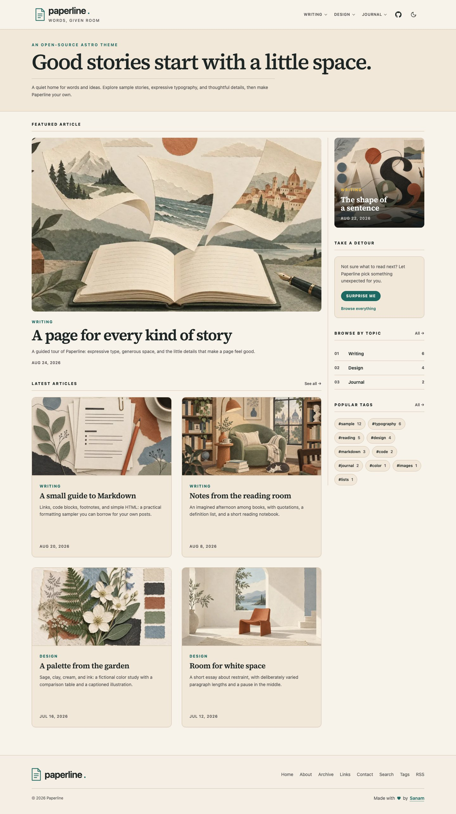
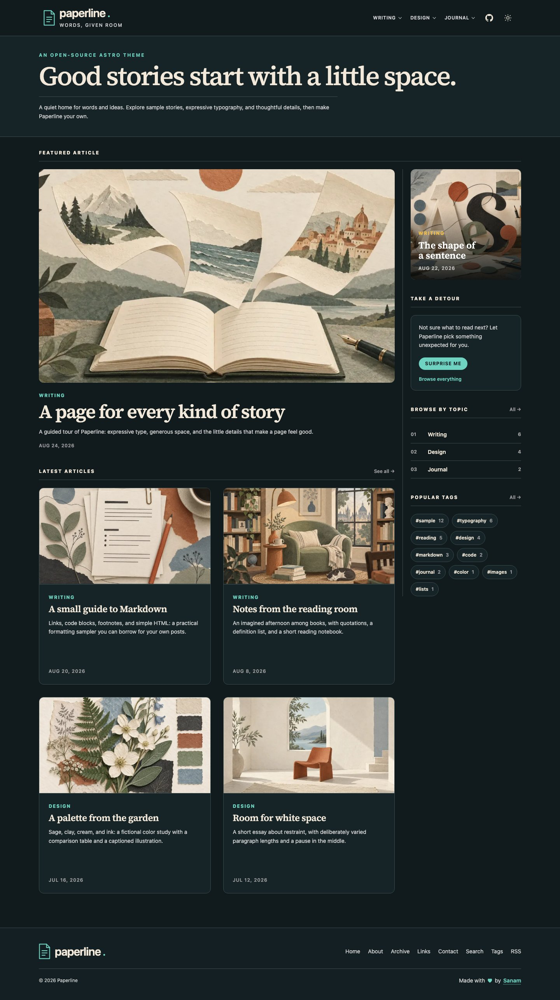
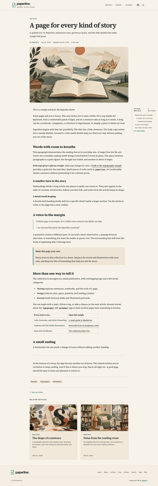

# Paperline

An open-source Astro blog theme with an editorial layout, thoughtful typography, and a warm paper-inspired palette.

[Live demo](https://paperline.potion.sh)



<details>
<summary>See dark mode and the reading experience</summary>

### Dark mode



### Inside an article



</details>

## Features

- **Astro 7, TypeScript, and Tailwind CSS 4** — a static site you can host anywhere.
- **Responsive editorial layout** — featured stories, article grids, and a compact mobile menu.
- **Light and dark themes** — follows the reader's system preference and remembers their choice.
- **Shared typography** — self-hosted Source Serif 4, with all font roles defined in one stylesheet.
- **Markdown and MDX** — code highlighting, tables, footnotes, quotes, image captions, and callouts.
- **12 illustrated sample posts** — ready-made examples of formatting and page layouts.
- **Organized browsing** — categories, sections, topics, tags, archives, and pagination.
- **Fuzzy search** — search article titles and descriptions, with shareable search URLs.
- **Reading tools** — reading time, an active table of contents, related articles, and “Surprise me.”
- **Publishing controls** — drafts and future-dated posts stay out of pages, search, and feeds.
- **SEO and feeds** — canonical URLs, social metadata, JSON-LD, RSS, and a sitemap.
- **Reader-friendly navigation** — keyboard controls, skip links, and a custom 404 page.
- **Development checks** — ESLint, Prettier, Bun tests, Playwright, and GitHub Actions.

## Get started

Use **Node.js 24 LTS** (24.21.0 or newer within 24.x) and **Bun 1.4.2**. The exact Node version is pinned in [`.nvmrc`](.nvmrc) and shared with the GitHub workflow. With nvm installed:

```bash
git clone https://github.com/antick/astro-paperline.git
cd astro-paperline
nvm install
nvm use
bun install --frozen-lockfile
bun run dev
```

Open the local URL printed in your terminal. Use Bun for package management so the shared lockfile stays consistent.

## Make it yours

The site lives in `apps/web/`. Start with these files:

| Change                                           | File or directory                                                                                                           |
| ------------------------------------------------ | --------------------------------------------------------------------------------------------------------------------------- |
| Site name, URL, descriptions, and page copy      | [`src/config.ts`](apps/web/src/config.ts)                                                                                   |
| Pagination, homepage counts, and reading options | [`src/settings.ts`](apps/web/src/settings.ts)                                                                               |
| Posts and their illustrations                    | [`src/content/blog/`](apps/web/src/content/blog/) and [`src/assets/samples/`](apps/web/src/assets/samples/)                 |
| Categories, sections, and topics                 | [`src/data/category.ts`](apps/web/src/data/category.ts)                                                                     |
| Fonts and theme colors                           | [`src/styles/typography.css`](apps/web/src/styles/typography.css) and [`src/styles/base.css`](apps/web/src/styles/base.css) |
| About, Contact, and other pages                  | [`src/pages/`](apps/web/src/pages/)                                                                                         |

Set `SITE.website` to your own domain before deploying. Replace the fictional sample posts, update the author details, and add your logo, favicon, and social image. Theme attribution is configured separately in [`src/data/creator.ts`](apps/web/src/data/creator.ts).

The demo banner and header GitHub link are optional. Turn off `features.demoBanner` and/or `features.repositoryLink` in `src/settings.ts` to remove them. Their copy and shared repository URL live in `TEMPLATE_DEMO` in `src/config.ts`. Dismissing the banner hides it for the current browser tab, including navigation and reloads.

To write a post, copy a sample `.md` or `.mdx` file and update its frontmatter. Choose categories, sections, and topics from your configured taxonomy. The [Markdown sample](apps/web/src/content/blog/a-small-guide-to-markdown.md) is a useful starting point.

Future-dated posts are published **when you rebuild after their publication date**. This is a static site, so scheduling requires a new build and deployment.

## Build and deploy

From the repository root:

```bash
bun run build
bun run preview
```

Deploy **`apps/web/dist/`** to your static host. Use `bun install --frozen-lockfile` as the install command and `bun run build` as the build command. Keep the host's normal 404 handling rather than rewriting missing URLs to the homepage.

## Development checks

```bash
bun run format:check
bun run lint
bun run test
bun run build
bun run test:site
bun run test:scenarios
```

For browser tests, install the browsers once from `apps/web` with `bunx --no-install playwright install chromium firefox webkit`, then run `bun run test:browser` from the repository root after building. These checks cover Chromium, Firefox, and WebKit, including mobile layouts. The [GitHub workflow](.github/workflows/check.yml) also runs a dependency audit.

Found a bug or have an idea? [Open an issue](https://github.com/antick/astro-paperline/issues). Contributions are welcome; run the checks above before opening a pull request.

## License

[MIT](LICENSE). Made with ♥ by [Sanam](https://sanam.id/) · [GitHub](https://github.com/antick).
